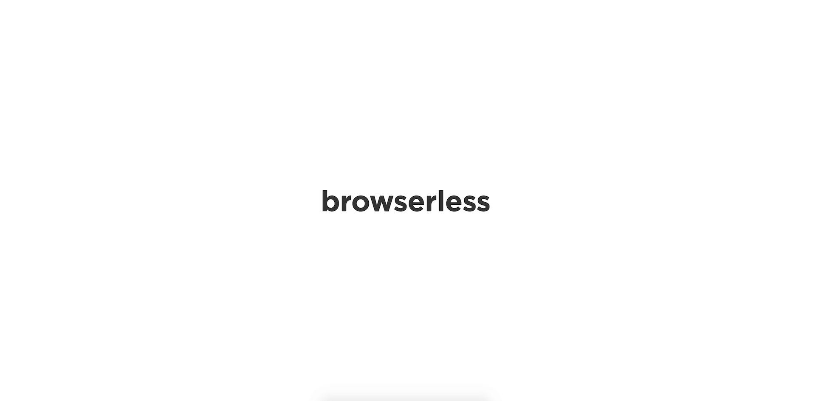
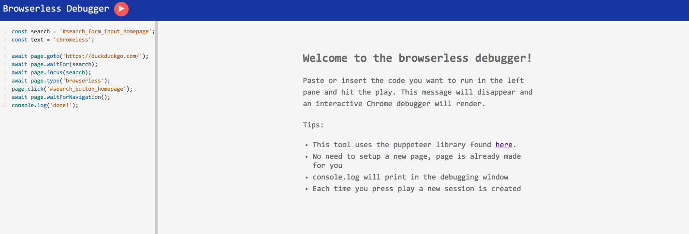

[Check out a live demo here](https://chrome.browserless.io/?token=59732425-a793-44ad-b9f0-8a04a1b92730).

[Docker repo here](https://hub.docker.com/r/browserless/chrome/).

Severless Chrome on your own infrastructure. Each session gets its own clean Chrome context for total isolation. After the session is complete Chrome is shutdown. You can also think of it like a database connection where your app connects to browserless, runs some work, and gets results back. No more worrying about Chrome availability or how to parallelize work as that's done for you seamlessly.

## Features

- Parallelization and queueing which are configurable
- Fonts and emoji's work
- docker releases that are built for specific puppeteer versions
- Gratuitously labelled with information on the version of Chrome, V8, webkit and more
- The best interactive debugging tool
- Works with just about any headless library
- Configurable session timers to keep things running smoothly

## How it works

Every Chrome library functions the same at the lowest level: over a websocket connection. When a websocket connects to browserless, Chrome is started (<100ms) and that socket is then proxied into Chrome. Once the session is done, Chrome is closed and browserless waits for further connections. Some libraries use Chrome's HTTP endpoints, like `/json` to inspect debuggable targets, which browserless also supports. These HTTP calls also generate a fresh copy of Chrome, and expose debugging endpoints which most libraries will connect to.

Your application still runs the script itself (much like a database interaction), which gives you total control over what library you want to chose and when to do upgrades. This is preferable over other solutions as Chrome is still breaking their debugging protocol quite frequently.

## Docker Quickstart

1. `docker pull browserless/chrome`
2. `docker run --shm-size=1gb -p 3000:3000 browserless/chrome`
3. Visit `http://localhost:3000/` to use the interactive debugger.

## Node Quickstart

You'll need Node version 8+ to install and run browserless.

1. `git clone https://github.com/joelgriffith/browserless.git`
2. `cd browserless`
3. `npm install`
4. `npm run dev`
5. Visit `http://localhost:3000/` to use the interactive debugger.

## Debugger



browserless ships with an interactive debugger that makes writing scripts faster and interactive. You can use things like `debugger;` and `console.log` to capture what's happening on the page while your script is running. All of the Chrome devtools are there at your disposal. A small list of features includes:

- Using debugging concepts like `debugger;` and `console.log`
- Errors in the script are caught and show up in the `console` tab
- You can inspect the DOM, watch network requests, and even see how the page is rendering
- Coming soon you'll be able to export the script which will produce a `index.js` and a `package.json` to get things going

## Hosting Providers

You can host this image on just about any major platform that offers hosting for docker. Alternatively, I'd appreciate you giving [browserless a shot](https://browserless.io) as it's built from the ground-up for headless browser workflows. It also has a nice list of features:

- Easily upgrade and toggle between versions at the press of a button. No managing repos and other code artifacts.
- Never need to update or pull anything from docker. There's literally zero software to install to get started.
- Scale your consumption up or down with different plans. We support up to 100 concurrent sessions at a given time.

If you're interested in using this image for commercial aspects, then please read the below section on licensing.

## Usage with puppeteer

Puppeteer allows you to specify a remote location for chrome via the `browserWSEndpoint` option. Setting this for browserless is a single line of code change.

**Before**
```js
const browser = await puppeteer.launch();
```

**After**
```js
await puppeteer.connect({ browserWSEndpoint: 'ws://localhost:3000' });
```

## Usage with chromeless

Chromeless allows for easy integration as well, and does so by allowing a `host` and `port` option in the `cdp` value. This tells the low-level `chrome-remote-interface` module to consume Chrome from a remote location.

**Before**
```js
const chromeless = new Chromeless()
```

**After**
```js
const chromeless = new Chromeless({ cdp: { host: 'localhost', port: 3000 } });
```

After that the rest of your script should remain the same with little to no changes.

## Usage with other libraries

Most libraries allow you to specify a remote instance of Chrome to interact with. They are either looking for a websocket endpoint, a host and port, or some address. Browserless supports these by default, however if you're having issues please make an issue in this project and we'll try and work with the library authors to get them integrated with browserless.

# Motivations

Running Chrome on lambda is a fantastic idea but in practice is quite challenging. You're met with pretty tough upload limits, building Chrome yourself, and then dealing with odd invocation issues should everything else go ok. A lot of issues in various repositories are due to just challenges of getting Chrome running smoothly in AWS (see [here](https://github.com/GoogleChrome/puppeteer/issues?q=is%3Aissue+is%3Aopen+sort%3Acomments-desc)). You can see for yourself by going to nearly any library and sorting issues by most commented.

Getting Chrome running well in docker is also a challenge as there's quiet a few packages you need in order to get Chrome running. Once that's done then there's still missing fonts, getting libraries to work with it, and having limitations on service reliability.

All of these issues prompted me to build a first-class image and workflow for interacting with Chrome in a more streamlined way. With browserless you never have to worry about fonts, extra packages, library support, or anything else. It should just work. On top of that it comes with a prescribed approach on how you interact with Chrome, which is through socket connections (similar to a database or any other external appliance). What this means it that you get the ability to drive Chrome remotely without having to do updates/releases to the thing that runs Chrome since it's divorced from your application.

# License

## Corporate license

If you want to use browserless to build commercial sites and applications then the corporate license is what you're after. Visit https://browserless.io for more details. This allows you to keep your software proprietary whilst still using browserless.

## Open source license

If you are creating an open source application under a license compatible with the GNU GPL license v3, you may use browserless under the terms of the GPLv3. You can read more about this license [here](https://www.gnu.org/licenses/quick-guide-gplv3.en.html).
